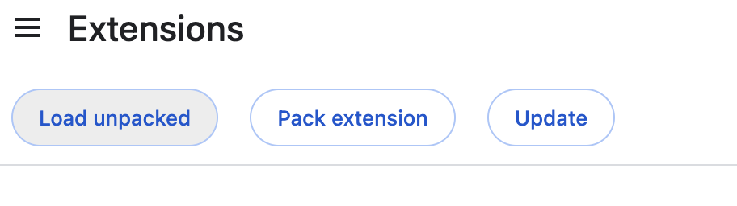
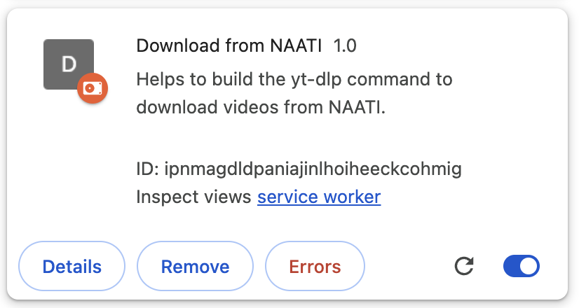

## Running This Extension

1. Download this extension from [here](https://github.com/kpldvnpne/naati-extension/archive/refs/tags/v1.zip).
2. Extract the file that is downloaded to Downloads folder.
3. Then, open new tab and go to [chrome://extensions](chrome://extensions).
3. Click on Load upacked and select the extracted folder from the Downloads folder.
   
4. When you are done, it should look like this:
   
